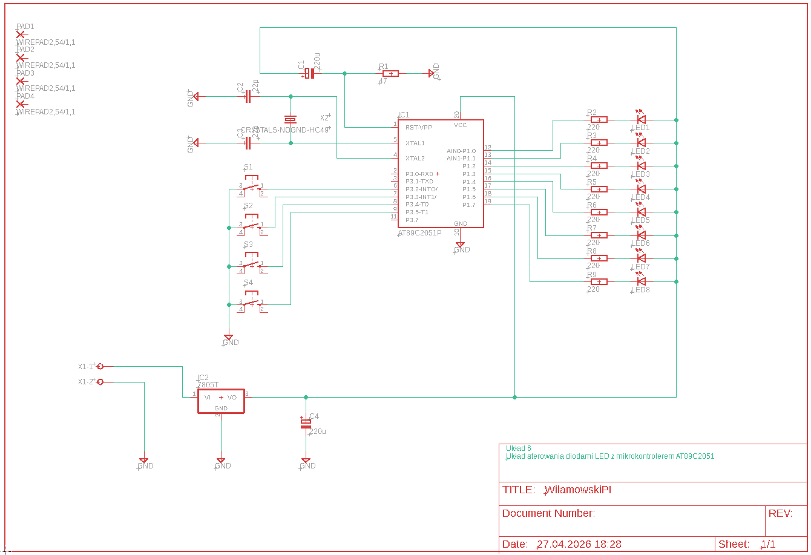
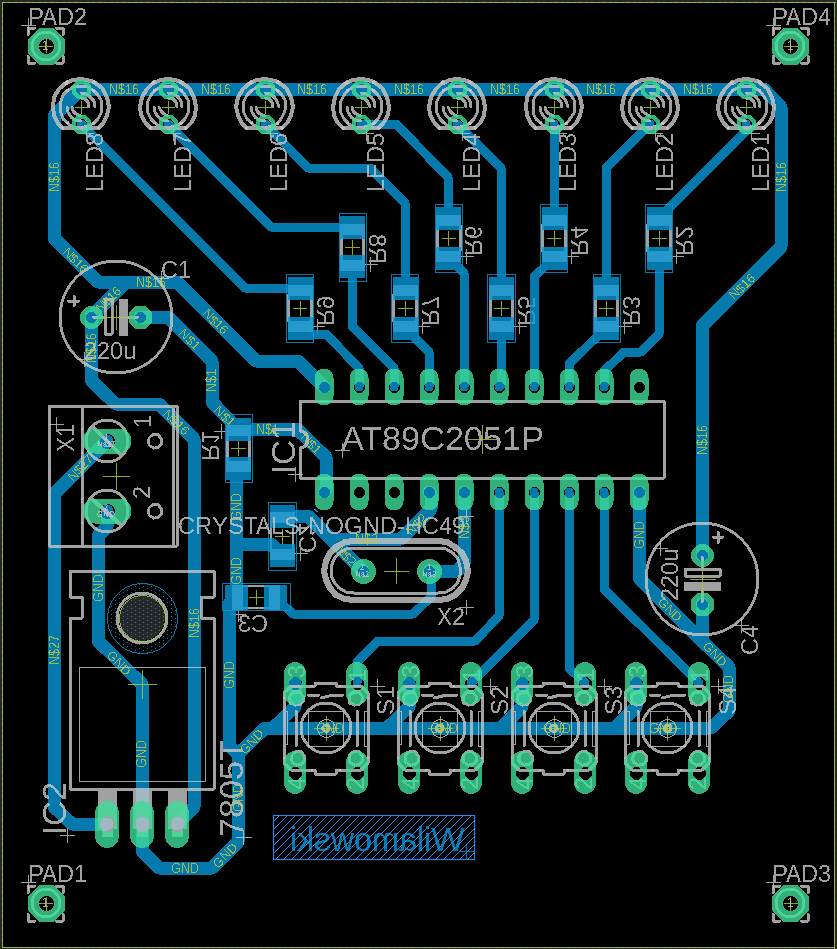

# Układ sterujący 8 diodami led przy pomocy 4 przycisków w oparciu o mikrokontroler AT89C2051

## Schemat ideowy układu

## Schemat połączeń płytki

## Wykorzystane narzędzia
* Autodesk Eagle 9.6.2
